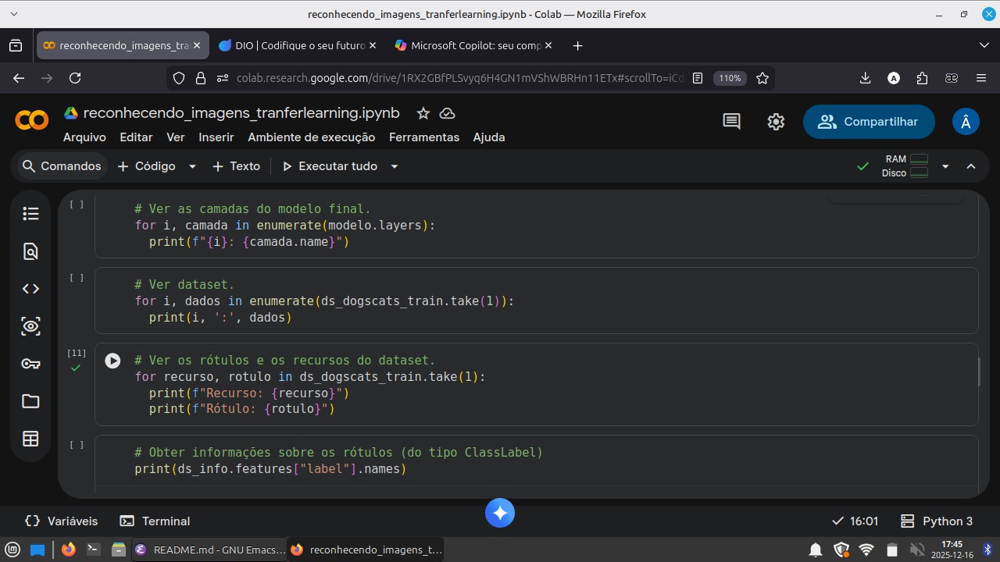

# Introdução.
Este projeto faz parte do programa de treinamento da dio **BairesDev - Machine Learning
Training**, como forma de aprendizado e exame. Nele eu refino um modelo pré-treinado para
classificar imagens de cachorros e gatos corretamente (uma classificação binária). O
arquivo README.md deste repositório descreverá a minha experiência concluindo esse desafio.
Informações sobre a pipeline de dados, código ou treinamento podem ser encontrados no
[notebook](detector_dogs_cats.ipynb), onde está contido o treinamento.

# Como foi.
Utilizei o modelo pré-treinado através do Keras e o banco de dados de imagens popular
imagenet. Além de Keras, também usei outros recursos do tensorflow e bibliotecas
auxiliares.


Não tinha experiência com frameworks Python de machine learning antes do projeto, nem
bibliotecas de dados. Então, precisei fazer pesquisas relacionadas a todas as bibliotecas
que usei, principalmente Keras e TensorFlow. Isso incluiu leitura de documentações, revisão
de aulas do programa da Dio e resolução de dúvidas com chatbots, além de tentativa e
erro. Já sei lógica de programação em Python, então aprender as funções e classes das APIs
fornecidas foi a parte mais fácil da pesquisa (embora não seja qualquer coisa).

Além de bibliotecas frameworks, também busquei informações sobre teoria de machine
learning, como normalização, camadas de rede neural, funções de ativação. O conhecimento
que eu já continha sobre isso que adquiri pelo programa, além de estudos pessoais prévios,
fizeram diferença, apesar de superficiais (superficiais no sentido de possui uma visão
geral de tudo, apesar de não consegui replicar perfeitamente os algorítimos matemáticos por
traz de funções de ativação, cálculos de perda, otimização do modelo, etc.). Entretanto,
acredito que no futuro, uma vez que dominasse o uso dos frameworks que abstraem isto,
poderia aprender isso com um tempo de estudo e pesquisa dedicado.


Apesar do instruído pela Dio ser baixar datasets de diferentes fontes recomendadas por ela,
decidi usar a API integrada para download e gerenciamento de datasets que o tensorflow
possui (o tensorflow_datasets). Isso exigiu que eu estudasse seu uso, porém ainda acho
menos extressante do que baixar e gerenciar datasets manualmente.

Em suma, desenvolvi os scripts para treinamento do modelo enquanto revisava e pesquisava, e
meus conhecimentos prévios que consegui no programa e antes dele me ajudaram, embora
precisasse de estudo adicional. O resultado é uma maior familiaridade com frameworks de
machine learning e uma visão geral melhor sobre essa área, ainda que não completa.

# Visualização de dados na pipeline de treinamento criada.
Não há gráficos ou diagramas na pipeline. O motivo para isso é que não sei bibliotecas de
visualização de dados, como matplotlib ou searbon, e achei o tempo de estudo desnecessário,
uma vez que as métricas de desempenho do modelo (acurácia, precisão, recall) e impressão
textual de informações (isto é, **print**) são suficientes para o treinamento, apesar disso
possivelmente se dever a minha inexperiência.

Segue uma imagem da sessão do notebook responsável pela visualização:


# Principais problemas.
## Datasets incompatíveis com modelos.
Por um tempo longo, não conseguir treinar o modelo inicialmente, e o principal problema era
que a entrada do modelo (isto é, o "input") não encaxaiva com os dados do dataset importado
do Tensorflow ("dogs\_vs\_cats"). Não lembro perfeitamente, mas acho que o problema estava
em modelos feitos com Keras possuirem um "input" com uma dimenção a mais por natureza, que
corresponde aos lotes de treinamento, conhecidos como "batch", e os dados disponibilizados
não possuirem essa dimenção automaticamente. Dessa maneira, sem configuração adicional, as
entradas do modelo possuíam um formato (None, 224, 224, 3), comuns a imagens, e os recursos
do dataset tinham o formato (224, 224, 3), sem dimenção para batchs.

Criei a função a seguir para corrigir isso:
```
def redimensiona_img(img, label):
  image = tf.image.resize(img, (224, 224))
  image = tf.cast(image, tf.float32) / 255.0
  label = tf.cast(label, tf.float32)
  return image, label

ds_dogscats_train = ds_dogscats_train.map(redimensiona_img).batch(32)
ds_dogscats_test = ds_dogscats_test.map(redimensiona_img).batch(32)
```
Além de reformatar os dados, também os normaliza.

## Ausência de normalização.
Por alguns dias o treinamento do modelo não foi satisfatório por eu haver esquecido da
etapa de normalização de dados, de maneira que o modelo treinou algumas vezes com valores
muitos grandes. Isso fez com que o treinamento necessitasse de muitas épocas para atingir
uma convergência ruim. Corrigir isso acelerou o treinamento e melhorou o desempenho do
modelo.

## Treinamento excessivamente longo.
Antes de corrigi o problema da normalização, configurei o treinamento para 10 épocas, o que
prolongava o processo para cerca 3 horas. Isso é um problema para mim, por não poder manter
o computador onde trabalhei no projeto ligado por esse tempo.

Solucionei isso usando os recursos do Keras para salvar modelos, além de a normalização
me permitir diminuir o número de épocas e ainda ter uma melhor convergência.
